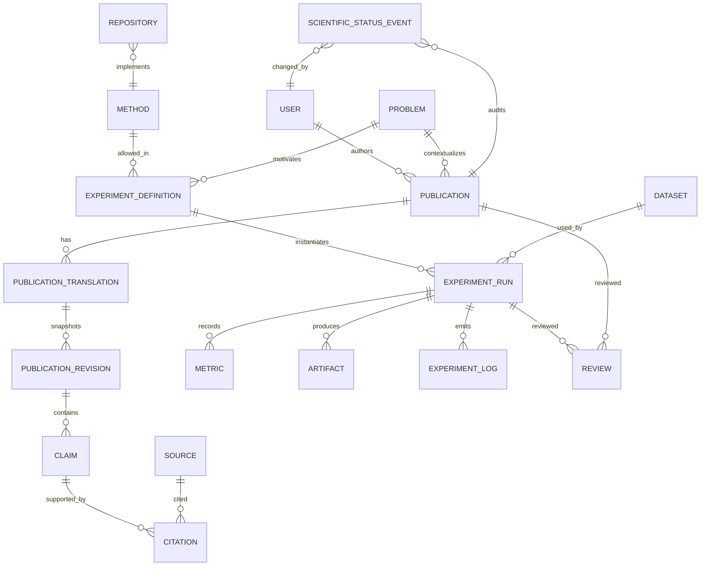

# Концептуальная модель данных

**Статус:** pre-migration model; физическая схема уточняется в Foundation/Content specs

## Основные агрегаты



## Идентичность и локализация

- Канонические сущности имеют UUID/ULID, не зависящий от языка.
- Перевод содержит locale, slug, три тела объяснения, SEO и translation status.
- Уникальность: `(locale, content_type, slug)`.
- `source_revision_id` связывает EN с RU revision; несовпадение автоматически
  даёт `stale`.

## Неизменяемость

- `PublicationRevision` — append-only snapshot.
- После старта `ExperimentRun.config_snapshot`, commit, environment и seed
  неизменяемы.
- `Artifact.checksum_sha256` и size обязательны до public state.
- Изменение научного статуса создаёт append-only event с actor, from/to,
  reason и timestamp.
- Публичный материал не удаляется обычным workflow: withdrawn/archived с
  причиной; hard delete только по отдельному правовому процессу.

## Очередь

`ExperimentRun` использует состояния:

```text
draft → queued → claimed → running
      → succeeded | failed | timed_out | cancelled
      → under_review → approved | rejected → published
```

Claim выполняется транзакционно через `SELECT ... FOR UPDATE SKIP LOCKED`.
Хранятся `claimed_by`, heartbeat, attempt, idempotency key и timeout. Retry
разрешён только для классифицированной технической ошибки и создаёт новый
attempt/event, не переписывая предыдущий результат.

## Разделение доступа

- Web-role: контент CRUD, enqueue allowlisted definition, read summaries.
- Worker-role: claim/heartbeat, write metrics/logs/artifact metadata; без user,
  session, publication или secret tables.
- Public serializer: явный allowlist; исключает internal path, raw log,
  credentials и private artifacts.

## Вопросы до физической схемы

- Generic FK для Review/Artifact или явные join-модели (предпочтительны явные
  связи ради целостности);
- хранение Markdown/structured blocks;
- допустимый размер metric series до вынесения в artifacts;
- retention raw logs и failed private runs;
- PostgreSQL enum против lookup tables (для аудируемых статусов предпочтительны
  code constants + event log, не изменяемые свободно из admin).
